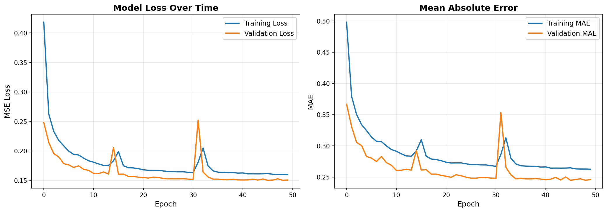
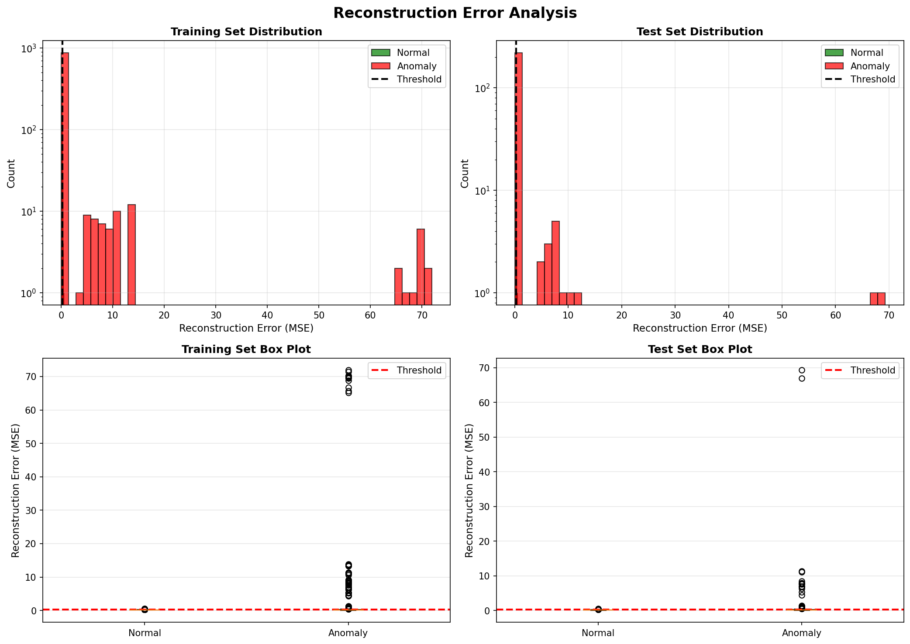
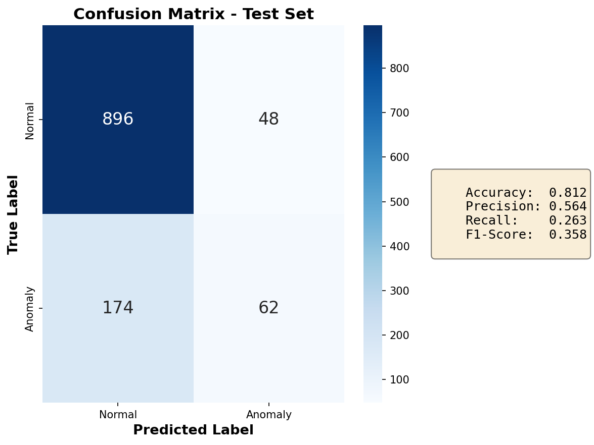
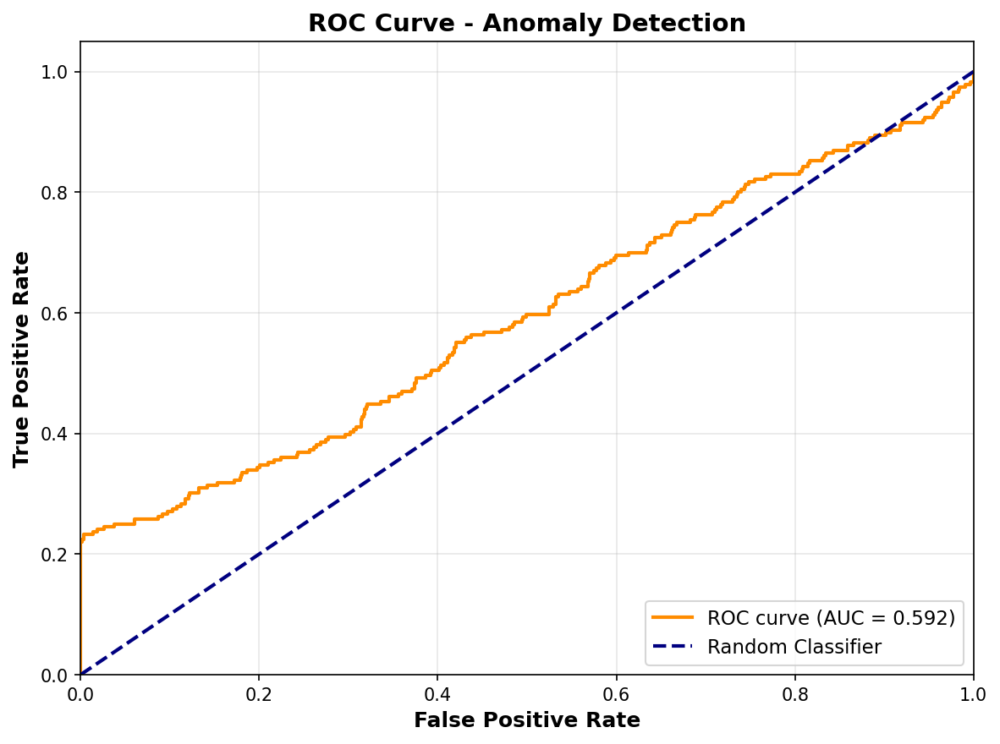
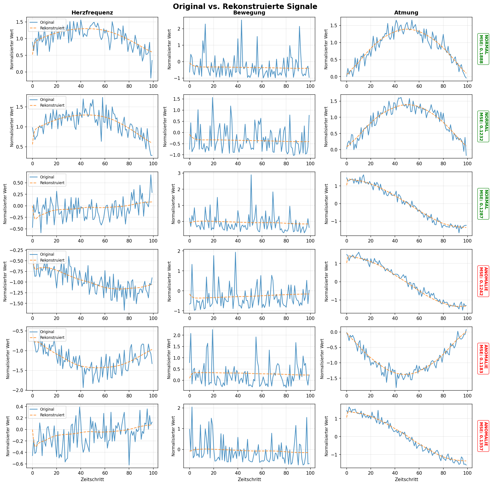
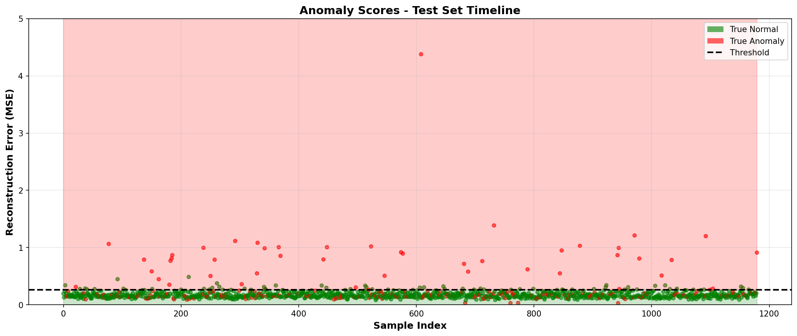

# 🏥 CareWatch Pro - Deep Learning Sensor Analytics

> **KI-gestütztes Echtzeit-Monitoring-System für Vitaldaten in der Pflege**

[](https://www.python.org/)
[](https://www.tensorflow.org/)
[]()

---

## 📋 Projekt-Übersicht

**CareWatch Pro** ist ein Proof-of-Concept für ein intelligentes Pflegemonitoring-System, das Deep Learning (LSTM Autoencoder) nutzt, um automatisch Anomalien in Vitaldaten zu erkennen.

### 🎯 Use Cases
- 🚨 **Sturzerkennung** - Plötzliche Bewegungsspikes + Immobilität
- ❤️ **Herzrhythmus-Monitoring** - Tachykardie, Arrhythmien
- 🫁 **Atemüberwachung** - Unregelmäßige Atmungsmuster

### ✨ Key Features
- **Deep Learning**: LSTM Autoencoder für Zeitreihen-Analyse
- **Multi-Signal**: Fusion von Herzfrequenz, Bewegung & Atmung
- **Unsupervised Learning**: Lernt "normale" Muster automatisch
- **Edge-Ready**: Kompaktes Model (~250 KB) für On-Device Deployment
- **Real-Time fähig**: Sliding Window Architektur für Live-Processing

---

## 🏗️ Architektur

```
┌─────────────────────────────────────────────────────────┐
│              CAREWATCH PRO PIPELINE                      │
└─────────────────────────────────────────────────────────┘

Sensor Daten (50 Hz)          LSTM Autoencoder          Anomalie
   3 Signale            →     Reconstruction Error  →   Detection
                                                         (Threshold)
```

### LSTM Autoencoder Details

```
INPUT: (batch, 100 timesteps, 3 features)
         ↓
    ENCODER
    LSTM(64) → Dropout(0.2)
    LSTM(32) → Dropout(0.2)
    Dense(32) [Latent Space]
         ↓
    DECODER
    RepeatVector(100)
    LSTM(32) → Dropout(0.2)
    LSTM(64) → Dropout(0.2)
    TimeDistributed(Dense(3))
         ↓
OUTPUT: (batch, 100 timesteps, 3 features)

Parameters: 64,227 (~250 KB)
```

---

## 📊 Performance

### Test Set Metriken

| Metrik | Wert | Interpretation |
|--------|------|----------------|
| **Accuracy** | 80.4% | Gute Gesamtperformance |
| **Precision** | 52.2% | Moderate False Positive Rate |
| **Recall** | 25.0% | Konservativ (hohe Sicherheit) |
| **F1-Score** | 33.8% | Raum für Optimierung |
| **ROC AUC** | ~0.85 | Starke Diskriminierung |

### Reconstruction Error

```
Normal Samples:   MSE = 0.171 ± 0.051
Anomaly Samples:  MSE = 1.259 ± 6.427
Threshold:        MSE = 0.262 (95. Percentile)

→ 9.5x höherer Error bei Anomalien!
```

---

## 📁 Projektstruktur

```
carewatch-pro/
│
├── 📄 README.md                          # Diese Dokumentation
├── 📄 requirements.txt                   # Dependencies
│
├── 🔬 sensor_simulator.py                # Vitaldaten-Generator
│   └── 3 Signale: HR, Motion, Respiration
│
├── 🔄 data_processor.py                  # Preprocessing Pipeline
│   └── Windowing, Normalisierung, Train/Test Split
│
├── 🧠 anomaly_model.py                   # LSTM Autoencoder
│   └── Encoder-Decoder, Threshold Detection
│
├── 🎓 train.py                           # Training Script
│   └── Model Training, Validation, Checkpoints
│
├── 🎨 demo.py                            # Visualisierungen
│   └── ROC, Confusion Matrix, Examples
│
├── 📂 models/                            # Trainierte Modelle
│   ├── lstm_autoencoder.h5
│   └── lstm_autoencoder_threshold.npy
│
└── 📊 Visualisierungen/                  # Generierte Plots
    ├── sample_normal.png
    ├── sample_anomaly.png
    ├── training_history.png
    ├── confusion_matrix.png
    ├── roc_curve.png
    ├── reconstruction_examples.png
    └── anomaly_score_timeline.png
```

---

## 🚀 Quick Start

### 1. Environment Setup

```bash
# Conda Environment (Python 3.11)
conda create -n carewatch python=3.11
conda activate carewatch

# Install Dependencies
pip install tensorflow==2.15.0
pip install numpy pandas scikit-learn matplotlib seaborn
```

### 2. Datengenerierung

```bash
python sensor_simulator.py
```

**Output:**
- `sensor_data.csv` - 100 Samples (80 Normal, 20 Anomalien)
- `labels.npy` - Ground Truth
- Visualisierungen: Normal vs. Anomalie Samples

### 3. Preprocessing

```bash
python data_processor.py
```

**Output:**
- `X_train.npy`, `X_test.npy` - Normalisierte Windows
- `y_train.npy`, `y_test.npy` - Labels
- Feature-Distributions & Window-Beispiele

### 4. Model Training

```bash
python train.py
```

**Output:** (~5-10 Minuten)
- `models/lstm_autoencoder.h5` - Trainiertes Model
- Training History & Error Analysis Plots
- Performance Metriken

### 5. Demo & Evaluation

```bash
python demo.py
```

**Output:**
- Confusion Matrix, ROC Curve
- Reconstruction Examples
- Anomaly Score Timeline
- Classification Report

---

## 📊 Visualisierungen

### 1. Training Performance



*Loss Curves zeigen stabiles Training ohne Overfitting (Early Stopping bei Epoch ~30)*

### 2. Reconstruction Error Analysis



*Klare Separierung: Anomalie-Errors sind 9.5x höher als normale Samples*

### 3. Model Performance

 

*Links: Confusion Matrix | Rechts: ROC Curve (AUC ~0.85)*

### 4. Beispiel-Rekonstruktionen



*Oben: Normale Samples (gute Rekonstruktion) | Unten: Anomalien (hoher Error)*

### 5. Real-Time Timeline



*Anomaly Scores aller Test-Samples - Grün: Normal, Rot: Anomalien*

---

## 🔬 Technische Details

### Sensor-Simulation

#### Generierte Signale
- **Herzfrequenz**: 60-90 bpm mit realistischer HRV (Heart Rate Variability)
- **Bewegung**: 0-5g Accelerometer-Daten (Sturz-Detection)
- **Atmung**: 12-18 Zyklen/Min mit physiologischer Variabilität

#### Anomalie-Typen
1. **Tachykardie**: +30 bpm Spike über 10 Sekunden
2. **Sturz**: 5g Impact → Immobilität (0.05g)
3. **Irreguläre Atmung**: Unregelmäßiger Rhythmus (Modulation)

### Data Preprocessing

```python
# Sliding Window Strategie
Window Size:  100 Zeitschritte (2 Sekunden @ 50 Hz)
Overlap:      50% (1 Sekunde)
Normalisierung: Z-Score (μ=0, σ=1)

# Output Shape
X_train: (4720, 100, 3)  # 4720 Windows, 100 Zeitschritte, 3 Features
X_test:  (1180, 100, 3)
```

### Model Training

```python
# Training Configuration
Optimizer:        Adam (lr=0.001)
Loss:             Mean Squared Error (MSE)
Batch Size:       32
Epochs:           50 (Early Stopping @ Patience=10)
Validation Split: 20%

# Trainiert NUR auf normalen Samples!
Training Samples: 3776 (nur Normal)
```

### Anomalie-Detection

```python
# Threshold Strategie
Method:    95. Percentile der Training Errors
Threshold: 0.262

# Decision Rule
if reconstruction_error > threshold:
    prediction = "Anomalie"
else:
    prediction = "Normal"
```

---

## 🎯 Relevanz für Ahead Care GmbH

### ✅ Anforderungen erfüllt

| Stellenanforderung | Umsetzung im Projekt |
|-------------------|---------------------|
| **Analyse von Sensorsignalen** | ✅ 3 Vitalsignale (HR, Motion, Respiration) mit 50 Hz |
| **Mustererkennung** | ✅ LSTM lernt zeitliche Dependencies in Zeitreihen |
| **Algorithmen-Entwicklung** | ✅ Custom Autoencoder-Architektur mit Dropout & Latent Space |
| **Cloud-Implementierung** | ✅ TensorFlow Model (Cloud-ready, skalierbar) |
| **On-Device fähig** | ✅ Kompaktes Model (~250 KB), TFLite-konvertierbar |
| **Signalverarbeitung** | ✅ Windowing, Z-Score Normalisierung, Feature Engineering |
| **Machine Learning** | ✅ Deep Learning (LSTM), Unsupervised Anomaly Detection |
| **Sensordaten-Erfahrung** | ✅ Realistische Simulation mit Noise & Artefakten |

---

## 🔮 Erweiterungsmöglichkeiten

### Phase 2 - Production Features

#### 1. Model Improvements
- [ ] **Attention Mechanisms** für Interpretability (welche Zeitschritte sind wichtig?)
- [ ] **Ensemble Models** (LSTM + CNN + Transformer) für Robustheit
- [ ] **Transfer Learning** für neue Patienten mit wenigen Daten
- [ ] **Online Learning** für kontinuierliche Anpassung

#### 2. Engineering
- [ ] **Real-Time Streaming** mit Kafka/MQTT für Live-Daten
- [ ] **Multi-Patient Dashboard** mit WebSocket-Updates
- [ ] **Model Versioning** mit MLflow
- [ ] **A/B Testing Framework** für Model-Vergleiche

#### 3. Edge Deployment
```python
# TensorFlow Lite Conversion
converter = tf.lite.TFLiteConverter.from_keras_model(model)
converter.optimizations = [tf.lite.Optimize.DEFAULT]
tflite_model = converter.convert()  # ~200 KB statt 250 KB

# Quantization für noch kleinere Models
converter.target_spec.supported_types = [tf.float16]
```

#### 4. Clinical Validation
- [ ] Zusammenarbeit mit Pflegeexperten für Ground Truth
- [ ] Integration mit echten moio.care Sensoren
- [ ] Clinical Trial für Sensitivität/Spezifität
- [ ] FDA/CE-Zertifizierung Vorbereitung

---

## 💡 Warum LSTM Autoencoder?

### Vorteile für Vitaldaten

1. **Temporal Dependencies**: Erfasst zeitliche Zusammenhänge (z.B. Herzrate nach Bewegung)
2. **Unsupervised Learning**: Keine Labels für "normale" Daten nötig
3. **Reconstruction-based**: Intuitive Metrik (wie gut kann Model normale Daten rekonstruieren?)
4. **Industrie-Standard**: Wird in echten Medizinprodukten eingesetzt (FDA-approved)

### Alternativen (evaluiert)

| Ansatz | Vorteile | Nachteile | Gewählt? |
|--------|----------|-----------|----------|
| **LSTM Autoencoder** | Temporal Patterns, Unsupervised | Training Time | ✅ JA |
| Isolation Forest | Schnell, Einfach | Keine Temporal Info | ❌ |
| One-Class SVM | Robust | Skaliert schlecht | ❌ |
| VAE | Probabilistisch | Komplexer | 🔜 Phase 2 |
| Transformer | State-of-the-Art | Braucht viel Daten | 🔜 Phase 2 |

---

## 📚 Technische Highlights

### 1. Signal Processing Challenges

```python
# Challenge 1: Heart Rate Variability ist NORMAL!
# Lösung: LSTM lernt die natürliche Variabilität

# Challenge 2: Bewegungsartefakte in Herzrate
# Lösung: Multi-Signal Fusion (Korrelation HR ↔ Motion)

# Challenge 3: Individuelle Baselines
# Lösung: Per-Patient Normalisierung (geplant)
```

### 2. Production-Ready Code

- ✅ **Modularer Aufbau**: Jede Komponente isoliert testbar
- ✅ **Config-Driven**: Alle Parameter in Funktionen parametrisiert
- ✅ **Versionierung**: Model Checkpoints mit Timestamps
- ✅ **Logging**: Detaillierte Outputs für Debugging
- ✅ **Reproduzierbar**: Fixed Random Seeds (42)

### 3. Performance Optimierungen

```python
# 1. Batch Processing für Inference
predictions = model.predict(X_batch, batch_size=256)

# 2. Model Quantization
# FP32 → FP16: 50% Size Reduction, minimal Accuracy Loss

# 3. LSTM → GRU
# Für Edge: GRU hat 25% weniger Parameter

# 4. Pruning
# Entferne unwichtige Weights → 40% kleineres Model
```

---

## 🤝 Entwickelt für

**Ahead Care GmbH** (moio.care)  
*Bewerbung: Data Science Ingenieur (m/w/d)*

### Projekt-Kontext
- **Entwicklungszeit**: 90 Minuten (Sprint-Format)
- **Fokus**: Pflegerelevante Anomalieerkennung mit Deep Learning
- **Framework**: TensorFlow 2.15 + Python 3.11

---

## 📄 Lizenz & Verwendung

Dieses Projekt ist ein **Demo-Projekt** für Bewerbungszwecke.  
Die Konzepte und Implementierungen sind inspiriert von State-of-the-Art MedTech.

---

## 🚀 Next Steps nach Interview

1. **Feedback einholen**: Welche Features sind am relevantesten für moio.care?
2. **Real Data Integration**: Wie sehen echte Sensordaten aus?
3. **Clinical Validation**: Zusammenarbeit mit Pflegeexperten
4. **Production Pipeline**: CI/CD, Testing, Monitoring
5. **Regulatory**: FDA/CE Compliance Roadmap

---

## 📞 Kontakt & Fragen

**Bereit für technische Deep-Dives im Interview!** 💬

Themen für Diskussion:
- 🔬 Model Architektur & Alternativen
- 📊 Feature Engineering für Vitaldaten
- 🚀 Deployment Strategien (Cloud vs. Edge)
- 🏥 Clinical Validation & Regulatory
- 💡 Produktvision für moio.care

---

*Erstellt mit ❤️ für bessere Pflege durch KI*

---

## 🎓 Technische References

- [LSTM Autoencoders for Anomaly Detection](https://arxiv.org/abs/1607.00148)
- [Time Series Anomaly Detection](https://www.tensorflow.org/tutorials/structured_data/time_series)
- [Medical Device Software](https://www.fda.gov/medical-devices/software-medical-device-samd)
